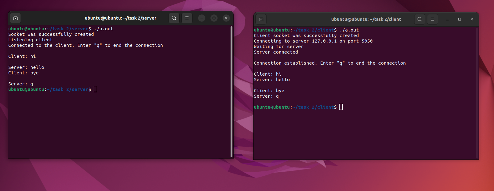

##  Чтобы запустить приложение, нужно открыть два терминала, затем прописать команды со скриншота ниже. Важное замечание: ***сначала запускается сервер***. Соединение происходит на порту 5050. Для прекращения передачи данных нужно отправить сообщение из одного символа ***"q"***.

## 📷 Скриншот

