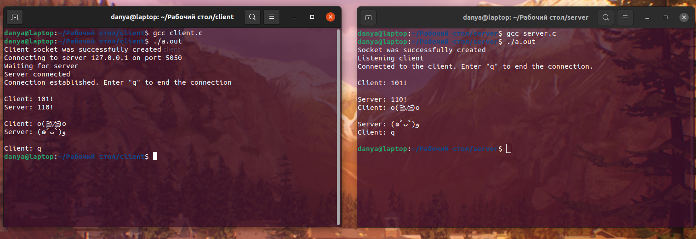

# 💻 Клиент-серверное консольное приложение

## 📗 Формулировка таски
Реализовать следующие механизмы IPC в виде клиента и сервера (consumer/producer) средствами языка программирования C / Java / Python.  
Переменные окружения Сигналы Каналы (именованные и неименованные) Сокеты (как минимум, начать) Для успешного выполнения задания, файлы с исходным кодом должны быть выложены в этом репозитории (в текущей директории) по аналогии с ДЗ #1. Результат выполнения программ должен быть зафиксирован на скриншоте и выложен в этом репозитории.

## ✏️ Кратко
Выбрал язык C (потому что на пайтоне уже , а джава слишком сложная). Чтобы запустить приложение, нужно открыть два терминала, затем прописать команды со скриншота ниже. Важное замечание: ***сначала запускается сервер***. Соединение происходит на порту 5050. Для прекращения передачи данных нужно отправить сообщение из одного символа ***"q"***. Оставил комментарии в коде объясняющие принцип работы.

## 📷 Скриншот

