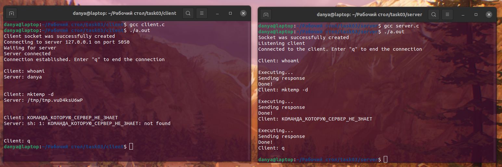

# 💻 Клиент-серверное консольное приложение на максималках

## 📗 Формулировка таски
Реализовать клиент-серверное приложение, в котором клиент аргументами командной строки получает ip адрес, порт и команду bash, которую должен выполнить сервер. Сервер получает строку с командой выполняет ее и возвращает результат выполнения клиенту. Клиент получает результат и прекращает работу. При получении сервером команды `exit` от клиента, его работа завершается. При обмене, оборачивать информацию в контейнер вида:

```
+-------------------+
| command | payload |
+-------------------+
```

Пример запросов с клиента: `exit | NULL`, `execute | ls -la \`, `execute | whoami`.

Пример ответов от сервера: `reponse | OK`, `response | .`, `response | fizzbuzz`.

Дизайн контейнера -- на усмотрение исполнителя.

Для успешного выполнения задания, файлы с исходным кодом должны быть выложены в этом репозитории (в текущей директории(./)) по аналогии с предыдущими ДЗ. Результат выполнения программ должен быть зафиксирован на скриншоте и выложен в этом репозитории.

## ✏️ Кратко
Заново всё писать не стал, так что доработал . Чтобы запустить приложение, нужно открыть два терминала, затем прописать команды со скриншота ниже. Важное замечание: ***сначала запускается сервер***. Соединение происходит на порту 5050. Для прекращения передачи данных нужно отправить сообщение из одного символа ***"q"*** (можно поставить вместо "q" "exit"). Оставил комментарии в коде объясняющие принцип работы.

## 📷 Скриншот

