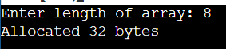

# Первая программа второй лекции

Программа просит указать длину массива. 
После проверки на ввод, приложение выделяет память для массива. 
Если по каким-либо причинам память не выделилась, функция malloc вернёт NULL, что программа и проверяет в той же строчке. 
После этого приложение выведет количество байтов, которое
было выделено. 
Если всё прошло успешно, программа очистит выделенную память. 

## Скриншот

