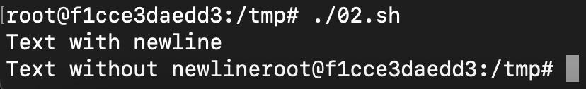
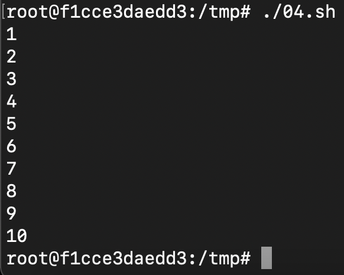
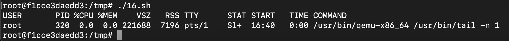

**01.sh**

"Hello World!"


**02.sh**

Вывести:
* Текст с переносом строки
* Текст без переноса строки

Для второго случая использовать `echo` с необходимым параметром. Для просмотра доступных параметров можно воспользоваться командой `help echo`



**03.sh**

Написать скрипт, включающий в себя:
* Однострочный комментарий
* Многострочный комментарий


*Хинт: для второго случая использовать следующую конструкцию комментария:*

```
: '
text
text
..
'
```

Вывести после каждого комментария результат каких-либо вычислений:

```
((res=4+5))
echo $res
```

**04.sh**

Вывести последовательность чисел от 1 до 10 с использованием цикла `while`



**05.sh**

Вывести в одну строчку через пробел последовательность чисел от 10 до 1 с использованием цикла `for` и декремента. После завершения работы цикла добавить перенос строки:


**06.sh**

Получить имя пользователя с помощью команды `read` и вывести приветствие:


**07.sh**

Используя условный оператор `if` выполнить проверку на количество введенных пользовтелем символов. Если пользователь не ввел ни одного символа -- вывести соответсвующее сообщение. Иначе -- вывести пользовательское сообщение:


**08.sh**

Реализовать "форму авторизации". Запросить с помощью `read` "логин" и "пароль". В случае ввода определенной комбинации (например `admin:123456`) вывести сообщение об успехе. Иначе -- сообщение об ошибке. Использовать оператор `&&`.


**09.sh**

Реализовать скрипт, определяющий принадлежность введенного пользователем слова к названию времен года _(winter, spring, summer, autumn)_. Использовать условный оператор `||`. Если введено время года -- вывести "Correct!", иначе -- "Incorrect!"


**10.sh**

Доработать скрипт **09.sh** добавив отдельный вывод для одного из корректных вариантов ввода. Использовать оператор `elif`.


**11.sh**

Доработать скрипт **10.sh**, использовав оператор `case`.


**12.sh**

Реализовать скрипт, принимающий и выводящий в одну строчку 2 аргумента. На второй строчке вывести количество переданных аргументов (используя конструкцию языка для подсчета).


**13.sh**

Реализовать скрипт, выводящий таблицу умножения на 2. Использовать цикл `for` или `while`.


**14.sh**

Реализовать скрипт, рассчитывающий сумму введенных чисел, реализовав функцию `function Sum()` и вызвав ее. Ввод слагаемых считывать с помощью `read`.


**15.sh**

Реализовать скрипт, ожидающий ввод числа и определяющий принадлежность этого числа к множеству четных/нечетных чисел.


**16.sh**

Реализовать скрипт, выводящий "шапку" таблицы процессов и последний процесс в приведенном ниже формате. Использовать по отдельности команды `head` и `tail` с необходимыми аргументами.



**17.sh**

Реализовать скрипт, возвращающий количество доступных процессоров. Использовать информацию из `/proc/cpuinfo`.


**18.sh**

Реализовать скрипт, проверяющий наличие файла. Путь до файла передавать первым аргументом при вызове.


**19.sh**

Реализовать скрипт, принимающий первым аргументом название файла; создающий его; выводящий листинг по названию файла; удаляющий файл; повторно выводящий листинг. Использовать команды `touch`, `ls`, `rm`.


**20.sh**

Реализовать скрипт, создающий папку. В случае, если папка уже существует, вывести сообщение об этом и закончить выполнение. Название папки получить через `read`.


**21.sh**

Реализовать скрипт, вычитывающий содержимое файла line-by-line. Путь до файла передать первым аргументом при вызове. Использовать конструкцию `while read line; do`.


**22.sh**

Реализовать скрипт, выводящий случайное число. Правую границу диапазона передать первым аргументом при вызове.


**23.sh**

Реализовать скрипт, выводящий дату запуска и дату завершения его работы. Между двумя выводами использовать `sleep`. Количество секунд передать в первом аргументе при запуске. 


**24.sh**

Реализовать скрипт, выводящий "раскрашенный" первый аргумент.


**25.sh**

Реализовать скрипт, определяющий размер директории (`du`). Отобразить вывод в human-readable формате. Путь до целевой директории передать первым аргументом.


**26.sh**

Реализовать скрипт, инициирующий 2 процесса (например, `sleep 1 &`), и завершающийся после завершения последнего из процессов (`wait`).


**27.sh**

Реализовать скрипт, конвертирующий Unix time в human-readable дату. Исходное значение Unix time передавать первым аргументом.


**28.sh**

Реализовать скрипт создания временной директории. Использовать механизмы ОС.


**29.sh**

Реализовать скрипт, выводящий количество символов в самой длинной строке файла. Путь до исходного файла передавать первым аргументом.


**30.sh**

Реализовать скрипт, возвращающий дату последнего изменения файла. Путь до исходного файла передавать первым аргументом.


